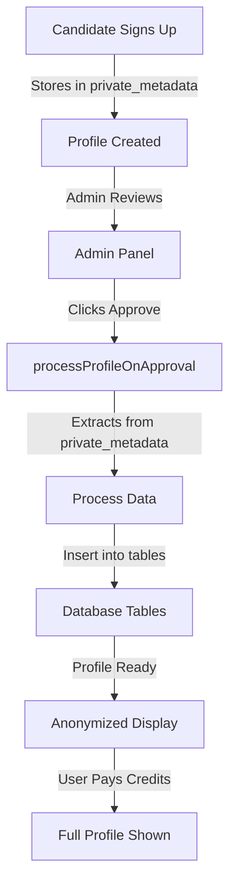

# Quick Reference: Profile Enrichment Flow

## 🚀 The Complete Flow



## 📁 Key Files

| File | Purpose |
|------|---------|
| `/app/api/v1/candidates/signup/route.ts` | Handles signup, stores data in private_metadata |
| `/app/api/admin/candidates/[id]/approval/route.ts` | Admin approval endpoint |
| `/lib/services/admin-profile-processor.ts` | Core processing logic |
| `/app/api/search/profiles/[id]/route.ts` | Profile display with credit checks |

## 🗄️ Data Storage

### On Signup (private_metadata)
```json
{
  "dealExperiences": [...],     // Stored here initially
  "boardCommittees": [...],     // Stored here initially
  "boardExperienceTypes": [...], // Stored here initially
  "workExperiences": [...]      // Also inserted to DB directly
}
```

### After Approval (Database Tables)
- `deal_experiences` - All PE transactions
- `board_committees` - Committee memberships  
- `board_experience_types` - Board types (FTSE, PE, etc.)
- `work_experiences` - Employment & board positions

## 🔍 Quick Debugging

### Check Profile Status
```bash
npx tsx scripts/check-james-status.ts
```

### What to Look For
- ✅ `is_active: true` - Profile approved
- ✅ `profile_completed: true` - Ready for display
- ✅ `is_anonymized: true` - Hidden behind credits (correct!)
- ✅ Data in database tables - Processing worked

### Common "Issues" (Working as Designed)
1. **"Executive Profile" instead of name** → Profile is anonymized for credits
2. **No PE data showing** → User needs to unlock with credits
3. **"Failed to parse admin_notes"** → Normal after processing

## 🧪 Testing Commands

### 1. Create Test Profile
```bash
npx tsx scripts/create-test-profile-james.ts
```

### 2. Verify After Approval
```bash
npx tsx scripts/verify-elizabeth-profile.ts
```

### 3. Debug Display Issues
```bash
npx tsx scripts/debug-james-profile.ts
```

## 💡 Key Insights

1. **Signup stores everything in `private_metadata`** - This is the source of truth
2. **Approval triggers processing** - Moves data from metadata to tables
3. **Profiles are anonymized by default** - Respects the credit system
4. **Processing is idempotent** - Safe to run multiple times

## 🚨 Important Notes

- The processor looks in `private_metadata` FIRST (not admin_notes)
- Work experiences are inserted during signup AND processing
- All PE-specific data requires approval to be processed
- The credit system controls what users see, not what's stored